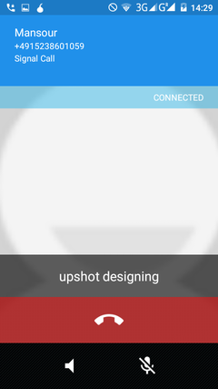

# Call alert
When you get a signal call, you'll see on your screen "SIGNAL CALL"
 
# Caller verification
When you answer you'll see two words. Say one word to your friend and ask them to say the other world. This makes sure you are both who you say you are.
 

 
This is the end of the lesson. Please click the Home button on your left to go back to the menu.
